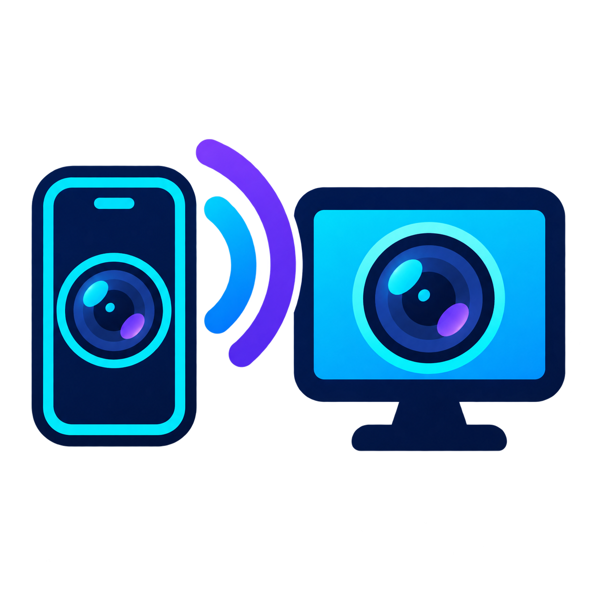

<div align="center">
  

# iMirror

**Turn an iPhone or Android phone into a private wireless webcam for Windows 11.**

Local WebRTC · QR pairing · Windows virtual camera · No account · No cloud video · Open source

[](https://github.com/Nikoxx99/iMirror/releases/latest)
[](https://github.com/Nikoxx99/iMirror/releases/latest)
[](https://github.com/Nikoxx99/iMirror/actions/workflows/ci.yml)
[](LICENSE)

[Download iMirror for Windows 11](https://github.com/Nikoxx99/iMirror/releases/latest) · [Website](https://nikoxx99.github.io/iMirror/) · [Report a bug](https://github.com/Nikoxx99/iMirror/issues)

</div>

## Your phone camera, available in Windows

iMirror is an open-source DroidCam and Camo alternative for modern Windows PCs. Scan a QR code, allow camera access in Safari or Chrome, approve the phone on the desktop, and select **iMirror Camera** in OBS, Google Meet, Zoom, Discord, Microsoft Teams, or another 64-bit camera app.

The default path stays on your local Wi-Fi network:

```text
iPhone / Android browser
        │ encrypted WebRTC over local Wi-Fi
        ▼
iMirror for Windows 11
        │ RGBA shared-memory frame bridge
        ▼
iMirror Camera (64-bit DirectShow)
        │
        └── OBS · Meet · Zoom · Discord · Teams
```

## Features

- iPhone Safari and Android Chrome camera capture without a mobile app.
- Short-lived QR pairing token plus explicit desktop approval.
- Encrypted HTTPS/WSS setup and peer-to-peer WebRTC video on the LAN.
- Front/rear camera selection and 360p, 540p, or 720p profiles.
- Live desktop preview and automatic stale-frame dropping.
- Native camera picker entry named **iMirror Camera** for 64-bit Windows apps.
- OBS capture window as a fallback.
- Local trusted-device list and security audit history.
- No account, telemetry, subscription, cloud relay, or automatic recording.

## Install and use

1. Download the latest `iMirror_*_x64-setup.exe` from [Releases](https://github.com/Nikoxx99/iMirror/releases/latest).
2. Install and open iMirror. The current community build is unsigned, so Windows SmartScreen may show a warning.
3. Open **Virtual Camera** and choose **Install iMirror Camera**. Accept the Windows administrator prompt once.
4. Scan the QR code from an iPhone or Android phone connected to the same Wi-Fi.
5. On first use, follow the four on-screen steps to trust the local iMirror certificate. This lets Safari grant camera permission to a page served directly by your PC.
6. Open the secure camera page, grant camera access, and approve the phone in iMirror.
7. Restart any app that already had its camera list open, then choose **iMirror Camera**.

### Why does iPhone need a local certificate?

Safari only exposes the camera API to a secure HTTPS origin. iMirror creates a private certificate for the PC's current LAN address and serves it from the QR setup page. You install and trust it once on your own iPhone; its private key never leaves the PC. If the PC receives a different LAN IP, iMirror creates a new certificate and the phone must trust it again.

Remove the certificate from the iPhone at any time under **Settings → General → VPN & Device Management**. Remove the virtual camera from iMirror with **Remove camera**.

## Requirements and scope

- Windows 11 x64, build 22000 or newer.
- Microsoft Edge WebView2 Runtime, included with current Windows 11 installations.
- A 64-bit target application with DirectShow camera support.
- iOS Safari or a modern Android browser with WebRTC.
- Phone and PC on the same reachable local network.

iMirror currently publishes video only. A virtual microphone, signed driver/installer, 4K capture, USB transport, macOS output, and Windows on ARM are not included in version 0.1.

Some managed, guest, university, and corporate Wi-Fi networks isolate devices from each other. In that case, use a private home network or a hotspot that permits peer-to-peer LAN traffic.

## Build from source

Prerequisites:

- Node.js 22+
- pnpm 11.3+
- Rust stable with the `x86_64-pc-windows-msvc` target
- Visual Studio 2022 Build Tools with the Desktop C++ workload

```powershell
git clone https://github.com/Nikoxx99/iMirror.git
cd iMirror
corepack enable
pnpm install --frozen-lockfile
pnpm typecheck
pnpm test
pnpm --filter @imirror/desktop tauri build --bundles nsis
```

The release profile enables LTO, size optimization, symbol stripping, one codegen unit, and abort-on-panic. The installer targets Windows 11 x64 and uses the system WebView2 runtime instead of bundling a browser engine.

Useful development commands:

```powershell
pnpm dev:phone
pnpm dev:desktop
pnpm check:rust
pnpm test:rust
pnpm benchmark:frame-pump
```

## Repository layout

```text
apps/desktop       Tauri + React desktop UI, local HTTPS/WSS, WebRTC receiver
apps/phone         Mobile camera PWA embedded into the Windows executable
apps/landing       SEO landing page deployed to GitHub Pages
packages/shared    Pairing, signaling, quality and security types
drivers/windows    64-bit UnityCapture DirectShow filter and scripts
docs               Architecture, security and troubleshooting notes
```

## Security and privacy

- Pairing links contain random credentials and expire after 10 minutes.
- Unknown phones require an explicit approval in the desktop app.
- Camera media uses WebRTC encryption and is not relayed through an iMirror server.
- The HTTPS certificate and private key are stored under the current Windows user's local app data.
- iMirror does not record, upload, or analyze video.
- The camera driver installation is visible and requires Windows administrator consent.

Read [SECURITY.md](SECURITY.md) and [docs/security.md](docs/security.md) before exposing development builds outside a trusted LAN.

## Known limitations

- The Windows camera output is an experimental 64-bit DirectShow filter based on UnityCapture, not a signed Media Foundation camera driver.
- Some sandboxed or ARM-native applications may not enumerate a DirectShow-only virtual camera.
- The first iPhone connection has a certificate-trust step because the phone page is served locally without a public domain.
- iOS stops browser camera capture when Safari is backgrounded or the phone is locked.
- Real-device iPhone testing is still required for each iOS release; automated checks cannot validate Apple's permission UI.

## Attribution

iMirror started as a named and product-focused derivative of [LensBridge](https://github.com/Abhi190702/lensbridge) by Abhijeet Ranjan. Its Git history and MIT notice are preserved. The Windows virtual camera layer uses the MIT-licensed `UnityCaptureFilter` from [UnityCapture](https://github.com/schellingb/UnityCapture); see [third-party notices](drivers/windows/THIRD_PARTY_NOTICES.md).

The iMirror icon was generated specifically for this project with OpenAI ImageGen and then packaged into the Windows and web assets.

## License

[MIT](LICENSE) © 2026 Nikoxx99, Abhijeet Ranjan, and contributors.
